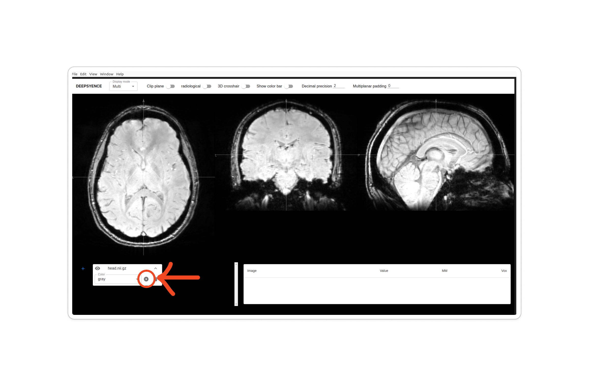

## Development setup
Install dependencies
```sh
yarn
```

then start the application

```sh
yarn start
```

## Usage

This prototype deployed a simple Unet model trained on 1 image.
The deployment didn't include preprocessing step so it only works on the image from training set.

To test the model, click the play button highlighted in the figure below.
